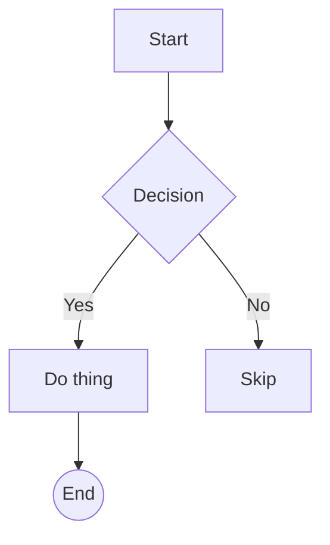
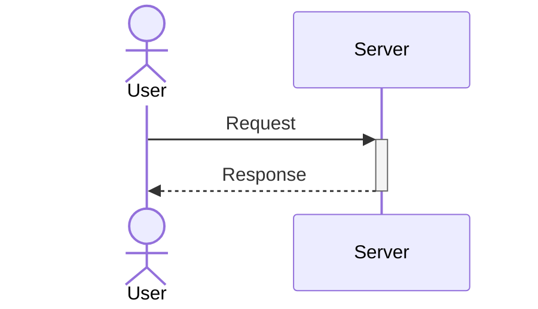
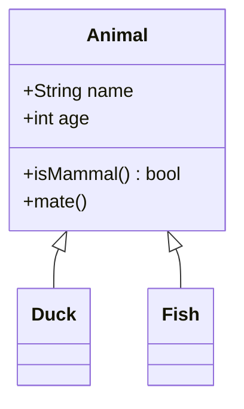
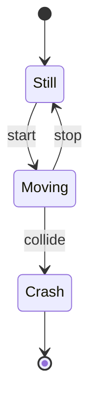
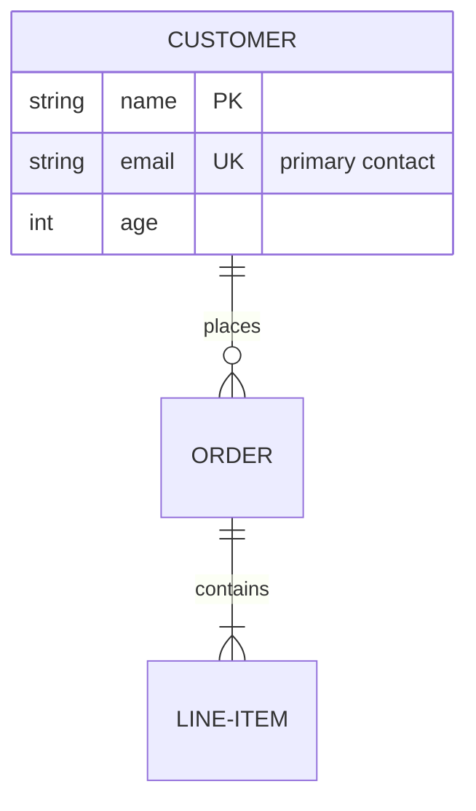
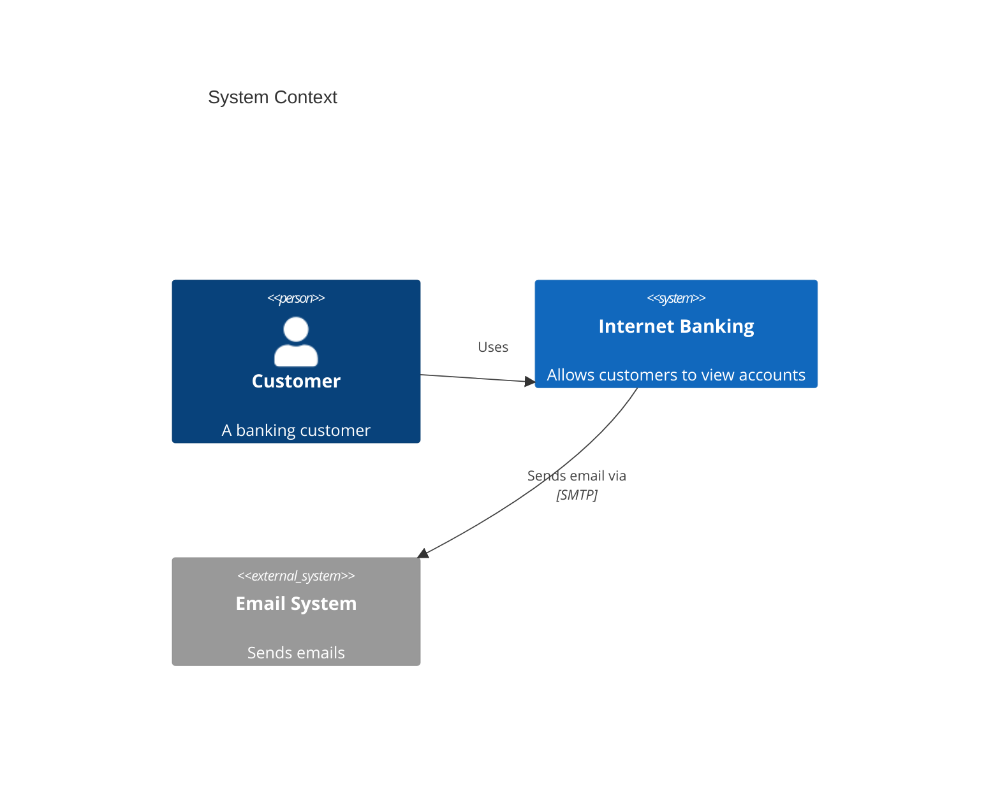

# Common Diagrams

Canonical syntax for the six most-used Mermaid diagram types: flowchart, sequence, class, state, ER, and C4. All samples verified against Mermaid v11.x.

## Table of Contents

- [Flowchart](#flowchart)
- [Sequence diagram](#sequence-diagram)
- [Class diagram](#class-diagram)
- [State diagram](#state-diagram)
- [ER diagram](#er-diagram)
- [C4 diagrams](#c4-diagrams)

## Flowchart



Header: `flowchart <DIR>` or `graph <DIR>`. Directions: `TB` / `TD` (top-down), `BT`, `LR`, `RL`.

**Node shapes:**

| Syntax | Shape |
|---|---|
| `A[text]` | Rectangle |
| `A(text)` | Rounded |
| `A([text])` | Stadium / pill |
| `A[[text]]` | Subroutine |
| `A[(text)]` | Cylinder (DB) |
| `A((text))` | Circle |
| `A>text]` | Asymmetric |
| `A{text}` | Rhombus (decision) |
| `A{{text}}` | Hexagon |
| `A[/text/]` / `A[\text\]` | Parallelogram |
| `A[/text\]` / `A[\text/]` | Trapezoid |
| `A(((text)))` | Double circle |

Mermaid 11.3.0+ introduced 30+ additional shapes via `A@{ shape: cyl, label: "DB" }`. Short names include `rect`, `rounded`, `stadium`, `diam`, `hex`, `cyl`, `doc`, `notch-rect` (card), `bow-rect`, `win-pane`, `cloud`, `bolt`. Also `A@{ img: "url" }` and `A@{ icon: "name", form: "square" }`.

**Edges:**

| Syntax | Meaning |
|---|---|
| `A --> B` | Arrow |
| `A --- B` | Line |
| `A -.-> B` | Dotted arrow |
| `A ==> B` | Thick arrow |
| `A --x B` | Cross end |
| `A --o B` | Circle end |
| `A ~~~ B` | Invisible link (layout only) |
| `A -->|label| B` | Labelled arrow |
| `A -- text --> B` | Alt label form |

**Subgraphs:**

```
subgraph title
    direction LR
    A --> B
end
```

**Gotchas:**
- Lowercase `end` as a node ID breaks parsing — use `End` or `END`.
- Node IDs starting with `o` or `x` after `---` create circle/cross endpoints — add a space: `dev --- ops`.
- Wrap labels with special chars in `"..."`; markdown strings use backticks: `A["`**bold**`"]`.

**Validation:**
- All branches reach a terminal node.
- Decision diamonds have 2+ labeled outputs.
- No dangling nodes (defined but unconnected).

## Sequence diagram



**Participants:**
- `participant A` (box) or `actor A` (stick figure).
- Alias: `participant A as "Long Name"`.
- Typed JSON form (v11+): `participant A@{ "type": "database", "alias": "DB" }`. Types: `participant`, `actor`, `boundary`, `control`, `entity`, `database`, `collections`, `queue`.
- Lifecycle (v10.3.0+): `create participant B`, `destroy B`.

**Arrows:**

| Syntax | Meaning |
|---|---|
| `->` | Solid, no head |
| `-->` | Dotted, no head |
| `->>` | Solid arrow |
| `-->>` | Dotted arrow (replies) |
| `<<->>` | Bidirectional (v11+) |
| `-x` / `--x` | Cross (lost message) |
| `-)` / `--)` | Async open arrow |

Activation shortcuts: `A->>+B: msg` activates B; `B-->>-A: reply` deactivates B.

**Blocks:**

```
loop every minute
  A->>B: ping
end

alt success
  A->>B: ok
else failure
  A->>B: retry
end

opt optional
  A->>B: maybe
end

par task A
  A->>B: ...
and task B
  A->>C: ...
end

critical Establish connection
option Network error
  A->>B: retry
end

break when disconnected
  A->>B: stop
end

rect rgb(200, 220, 255)
  A->>B: highlighted
end

box Aqua "Group Name"
  participant A
  participant B
end
```

**Notes:** `Note left of A: text`, `Note right of B: text`, `Note over A,B: spans both`.

**Gotchas:**
- Word `end` inside a message breaks parsing — wrap as `(end)`, `[end]`, `{end}`, or `"end"`.
- Multi-line messages use `<br/>`. Participant-name line breaks require aliases.
- `%%` starts a comment on its own line. `;` is a line break — escape as `#59;`.
- Add `autonumber` after `sequenceDiagram` to auto-number messages.

**Validation:**
- Every participant used in messages.
- Activations balanced (every `+` has a matching `-`).
- Time flows top to bottom.

## Class diagram



**Members:**
- Colon form: `Animal : +String name`.
- Block form inside `{ ... }`.
- `()` marks a method; no parens = attribute.
- Return type: `getName() String` (space before the type).

**Visibility prefixes:**

| Symbol | Meaning |
|---|---|
| `+` | Public |
| `-` | Private |
| `#` | Protected |
| `~` | Package / internal |

Classifier suffixes: `*` abstract, `$` static (`compute()*`, `count$`).

**Relationships:**

| Syntax | Meaning |
|---|---|
| `<|--` | Inheritance |
| `*--` | Composition |
| `o--` | Aggregation |
| `-->` | Association |
| `--` | Link (solid) |
| `..>` | Dependency |
| `..|>` | Realization |
| `..` | Link (dashed) |

Cardinality: `ClassA "1" --> "many" ClassB : label`. Values: `1`, `0..1`, `1..*`, `*`, `n`, `0..n`, `1..n`.

**Extras:**
- Generics: `class List~T~` (nested `List~List~int~~`; no commas).
- Annotations: `<<Interface>>`, `<<Abstract>>`, `<<Service>>`, `<<Enumeration>>`.
- Namespaces: `namespace Name { class A class B }`.
- Notes: `note "text"` (free) or `note for ClassName "text"`.
- Lollipop interface (v11): `bar ()-- foo`.

**Gotchas:**
- Class names: alphanumeric + `_` + `-` only.
- Two classes can't share a name with different generics.
- `:::cssClass` shorthand can't combine with a relation on the same line.

## State diagram

Always use `stateDiagram-v2` — the older `stateDiagram` renderer is legacy.



**States:**
- Simple: `StateName`
- With description: `state "Long description" as s1` or `s1 : description`.
- Start / end markers: `[*]`.
- Composite:
  ```
  state Configuring {
      [*] --> NewValueSelection
      NewValueSelection --> [*]
  }
  ```
- Choice: `state if_state <<choice>>`.
- Fork / join: `state fork_state <<fork>>`, `state join_state <<join>>`.
- Concurrent regions inside composite: separate with `--` on its own line.

**Transitions:** `A --> B : label`. Cannot cross composite boundaries into internal states.

**Notes:**

```
note right of A
  multi-line
  note
end note
note left of A : single line
```

**Styling (classDef):**

```
classDef bad fill:#f00,color:#fff
class Crash bad
[*] --> Still:::someStyle
```

`classDef` cannot apply to `[*]` or to states inside composites.

**Direction:** add `direction LR` / `TB` / `RL` / `BT` at the top to set orientation. Comments use `%%`.

**Validation:**
- Every state reachable.
- No dead-ends unless intentional.
- Composite states close cleanly.

## ER diagram



Statement form: `<entity1> <relationship> <entity2> : <label>`.

**Cardinality markers (crow's foot):**

| Left | Right | Meaning |
|---|---|---|
| `|o` | `o|` | Zero or one |
| `||` | `||` | Exactly one |
| `}o` | `o{` | Zero or more |
| `}|` | `|{` | One or more |

Word aliases accepted: `one or zero`, `zero or more`, `one or more`, `only one`, `1+`, `0+`, `many(0)`, `many(1)`.

**Line type:**
- `--` identifying (solid).
- `..` non-identifying (dashed).
- Aliases: `to` (solid), `optionally to` (dashed).

**Attributes:** `TYPE name KEY "comment"`.
- Keys: `PK`, `FK`, `UK`. Combine: `PK, FK`. `*` prefix on name also marks PK.
- Types: must start with a letter, may include digits, `-`, `_`, `()`, `[]`.
- Comment: double-quoted, no embedded `"`.

**Entity aliases:** `CUSTOMER["Customer Record"] { ... }`.

**Direction:** `direction TB` / `BT` / `LR` / `RL`.

**Gotchas:**
- Entity names with spaces must be double-quoted: `"Named Driver"`.
- No markdown / unicode inside key markers (PK/FK/UK).
- A statement is valid with just `first-entity`, but if any relationship part appears, all three parts (both cardinalities + second entity + label) are mandatory.
- Large diagrams: set `layout: elk` in frontmatter for better routing.

## C4 diagrams

Marked experimental — syntax may change. Compatible with C4-PlantUML.



**Diagram types:** `C4Context`, `C4Container`, `C4Component`, `C4Dynamic`, `C4Deployment`.

**Elements:**

| Context / General | Container | Component |
|---|---|---|
| `Person(alias, label, ?descr)` | `Container(alias, label, ?techn, ?descr)` | `Component(alias, label, ?techn, ?descr)` |
| `Person_Ext(...)` | `ContainerDb`, `ContainerQueue` | `ComponentDb`, `ComponentQueue` |
| `System(alias, label, ?descr)` | `Container_Ext`, `ContainerDb_Ext`, `ContainerQueue_Ext` | `Component_Ext`, `ComponentDb_Ext`, `ComponentQueue_Ext` |
| `SystemDb`, `SystemQueue` | | |
| `System_Ext`, `SystemDb_Ext`, `SystemQueue_Ext` | | |

Deployment: `Deployment_Node(alias, label, ?type, ?descr)` with short aliases `Node`, `Node_L`, `Node_R`.

**Boundaries** (nest children with `{ ... }`):
- `Boundary(alias, label, ?type)`
- `Enterprise_Boundary(alias, label)`
- `System_Boundary(alias, label)`
- `Container_Boundary(alias, label)`

```
System_Boundary(b1, "Banking") {
    Container(web, "Web App", "React")
    ContainerDb(db, "Database", "Postgres")
}
```

**Relationships:**

| Syntax | Meaning |
|---|---|
| `Rel(from, to, label, ?techn)` | Directed |
| `BiRel(from, to, label, ?techn)` | Bidirectional |
| `Rel_U` / `Rel_Up` | Directed up |
| `Rel_D` / `Rel_Down` | Directed down |
| `Rel_L` / `Rel_Left` | Directed left |
| `Rel_R` / `Rel_Right` | Directed right |
| `Rel_Back` | Reverse |
| `RelIndex(idx, from, to, label)` | Accepted; index ignored |

**Layout / styling (all optional):**
- `UpdateElementStyle(alias, $bgColor, $fontColor, $borderColor, $shadowing, $shape)`
- `UpdateRelStyle(from, to, $textColor, $lineColor, $offsetX, $offsetY)`
- `UpdateLayoutConfig($c4ShapeInRow="4", $c4BoundaryInRow="2")`

Styling statements must come **after** elements and relationships.

**Gotchas:**
- No automated layout — statement order controls position.
- `Lay_U/D/L/R` directives from PlantUML are **not** honoured.
- Not supported: sprites, tags, links, legends, `AddElementTag`, `AddRelTag`, custom shape helpers.
- Global themes don't apply; C4 uses fixed built-in styles.
- `RelIndex` accepts but ignores the index argument.
