# Diagram Selection

Quick guide for picking the right Mermaid diagram for a given need. Includes a one-line example per type so you can eyeball a match before reading the full syntax reference.

## Table of Contents

- [Selection matrix](#selection-matrix)
- [One-line samples](#one-line-samples)
- [Choosing between similar types](#choosing-between-similar-types)
- [When two types both fit](#when-two-types-both-fit)

## Selection Matrix

| Source material | Best type |
|---|---|
| Steps with branching, loops, decisions | `flowchart` |
| Chronological messages between actors/services | `sequenceDiagram` |
| Object model, inheritance, interfaces | `classDiagram` |
| Finite states + transitions (order lifecycle, workflow) | `stateDiagram-v2` |
| Database tables or domain entities | `erDiagram` |
| Layered system architecture (users, systems, containers, components) | `C4Context` / `C4Container` / `C4Component` |
| Brainstorm, concept map, topic overview | `mindmap` |
| Project schedule, tasks across calendar time | `gantt` |
| Ordered milestones without durations | `timeline` |
| User experience step-by-step with scores | `journey` |
| Git history, branches, merges | `gitGraph` |
| Proportions of a whole | `pie` |
| Two-axis categorization (2×2 matrix) | `quadrantChart` |
| Requirements with verification links | `requirementDiagram` |
| Bar or line chart | `xychart-beta` |
| Flow volumes through stages | `sankey-beta` |
| Grid layout of labelled blocks | `block-beta` |
| Cloud architecture with icons | `architecture-beta` |

## One-line samples

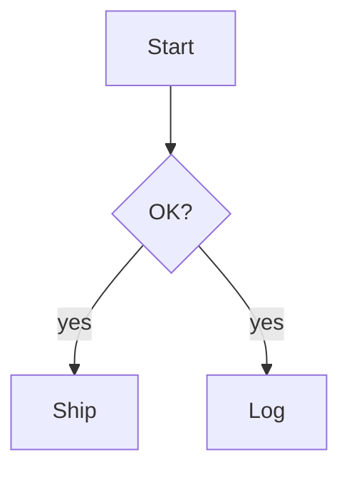

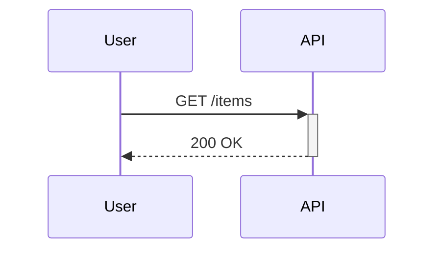

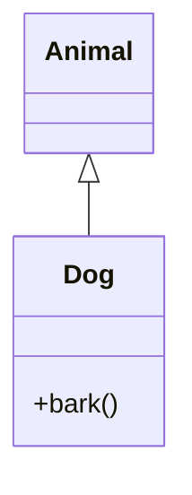

```mermaid
stateDiagram-v2
  [*] --> Draft --> Review --> Published --> [*]
```

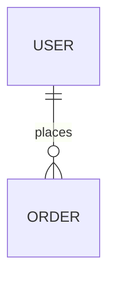

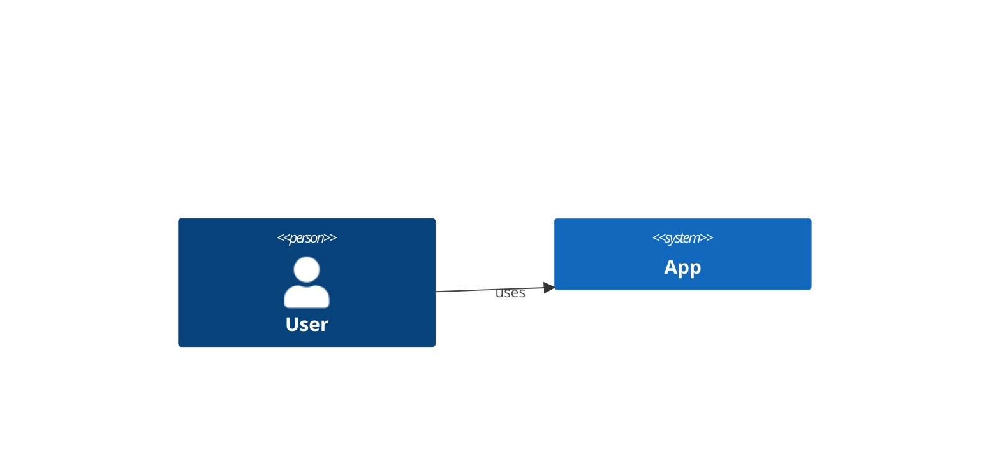

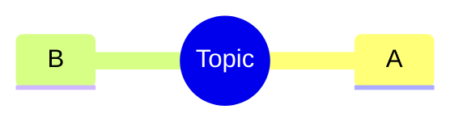

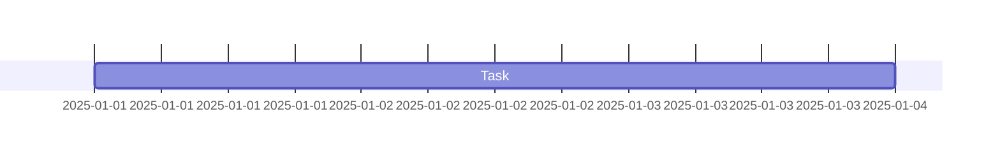

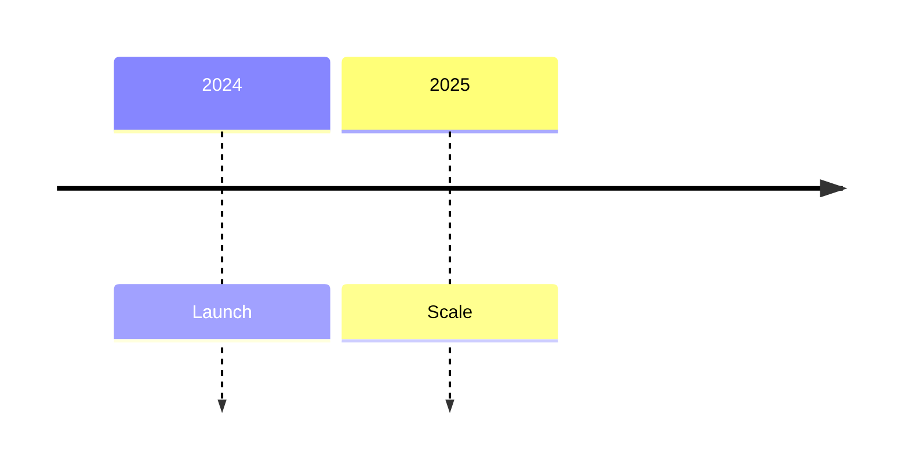

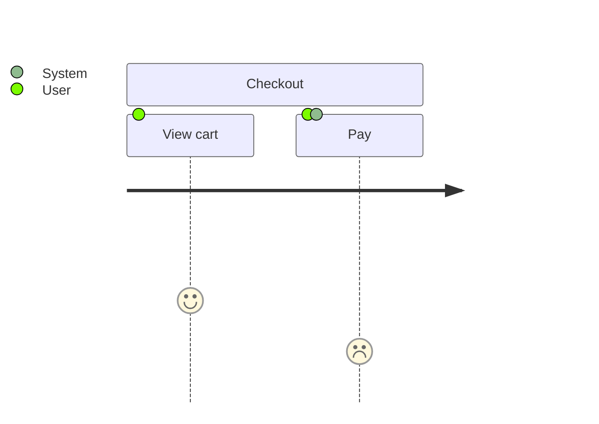

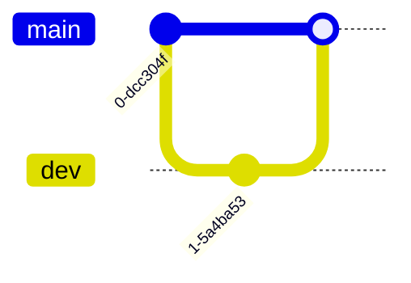

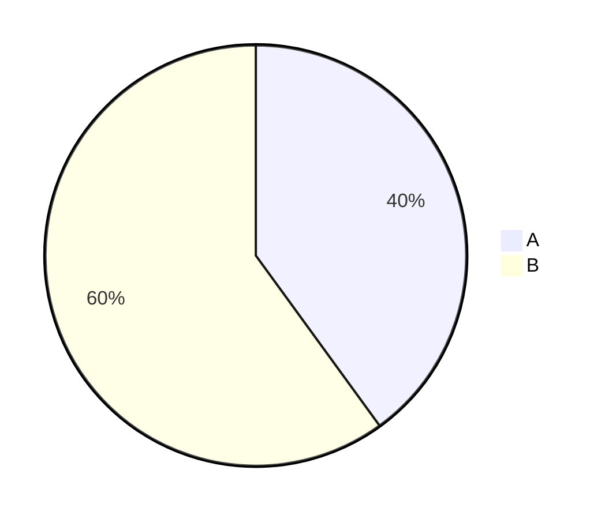

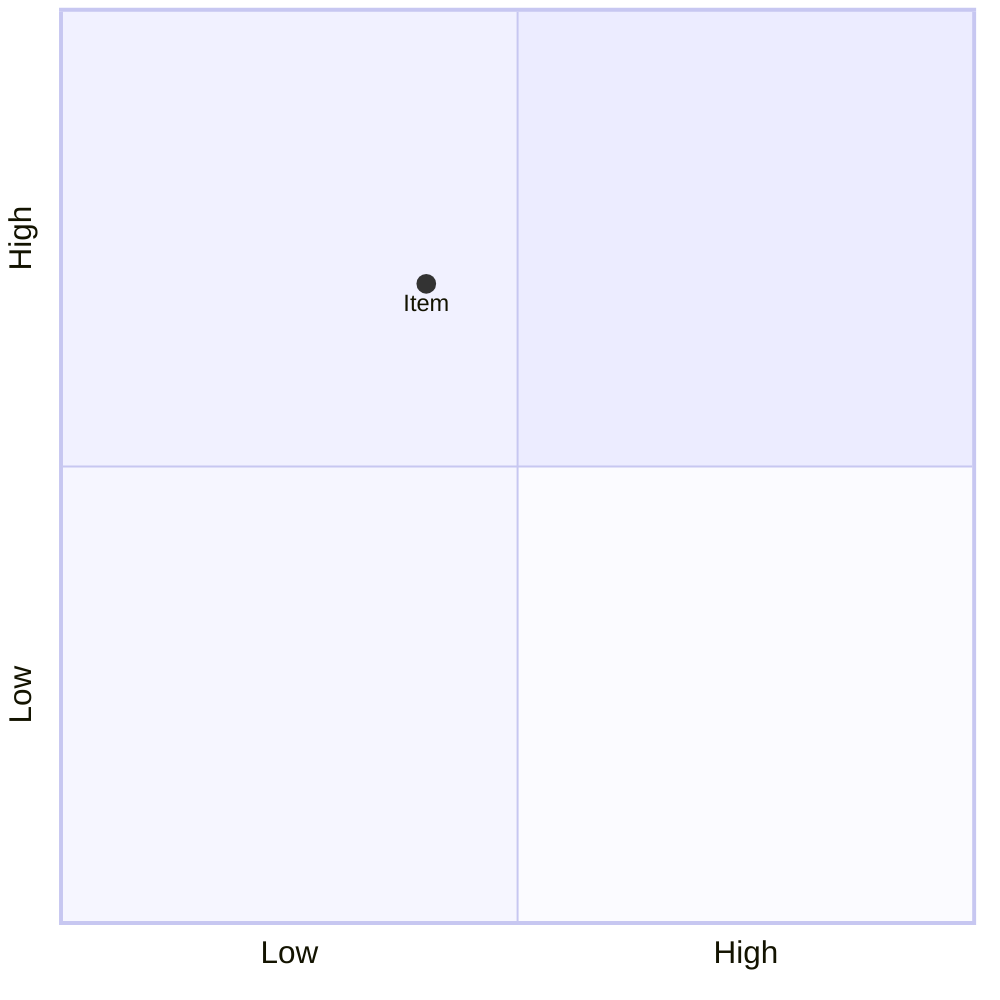

```mermaid
requirementDiagram
  requirement r1 { id: 1 text: "..." risk: low verifymethod: test }
  element e1 { type: simulation }
  e1 - satisfies -> r1
```

## Choosing between similar types

- **flowchart vs sequenceDiagram** — Use flowchart for decision logic; use sequence when time ordering between named actors matters.
- **stateDiagram vs flowchart** — Use state when each node is a stable resting state with discrete transitions; use flowchart when nodes are actions.
- **C4 vs flowchart** — Use C4 when showing users/systems/containers/components; use flowchart for internal logic.
- **classDiagram vs erDiagram** — Class for object model and methods; ER for data schema and cardinality.
- **mindmap vs flowchart** — Mindmap for hierarchy without flow; flowchart when direction matters.
- **gantt vs timeline** — Gantt for durations and dependencies; timeline for ordered events without calendar math.
- **block-beta vs flowchart** — Block for pure layout grid; flowchart when edges carry meaning.

## When two types both fit

Ask the user which to produce. Offer one short reason per option. Don't generate both.
