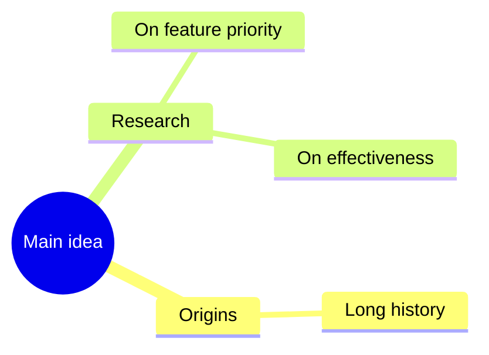
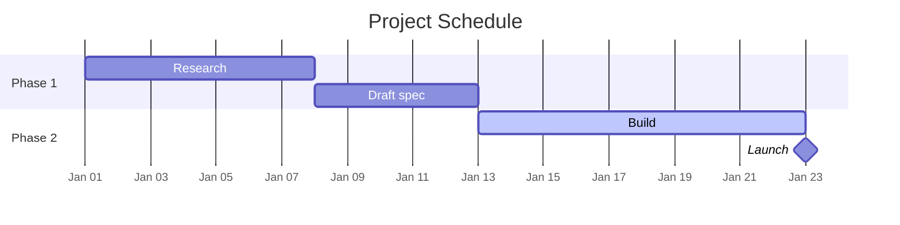
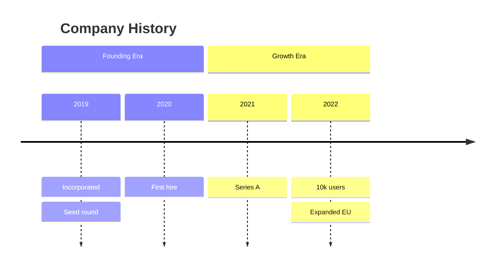
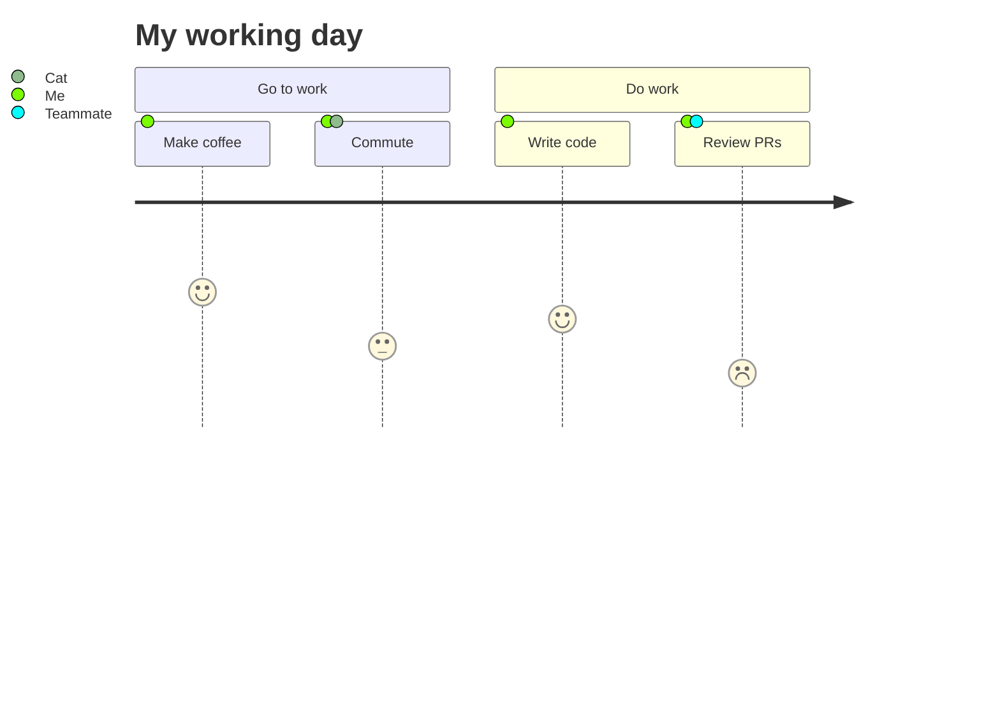
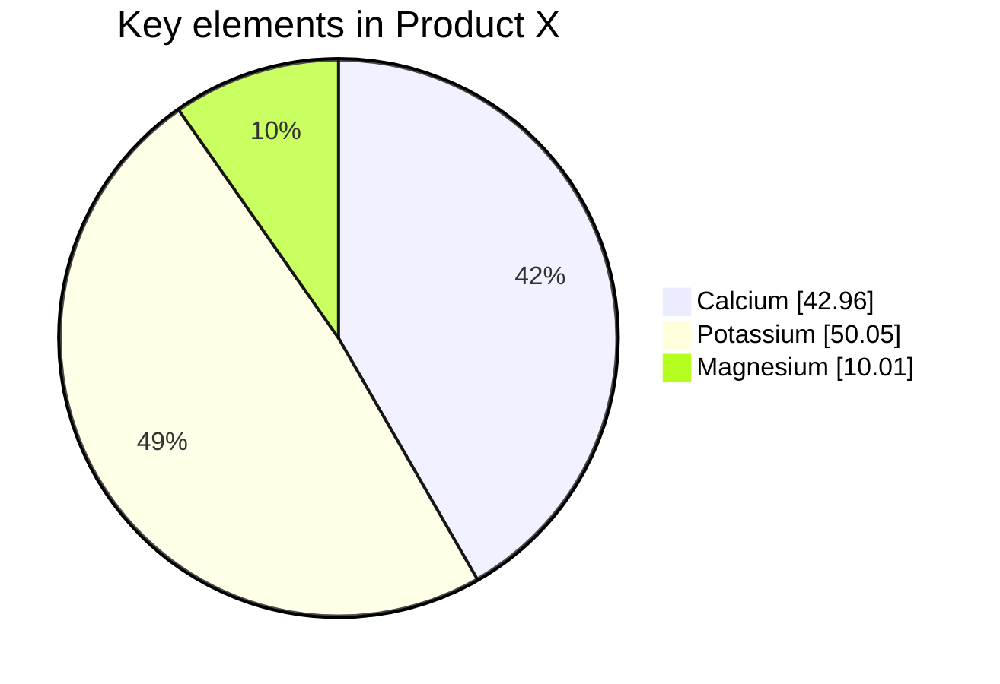
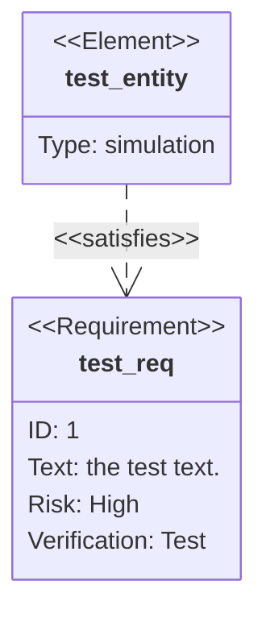
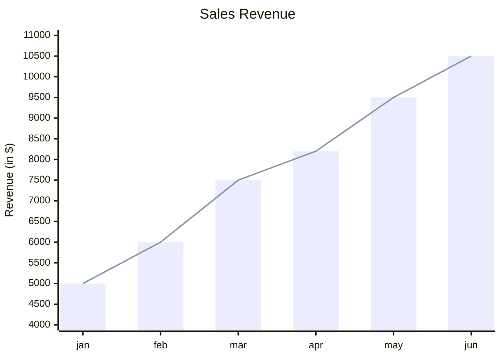
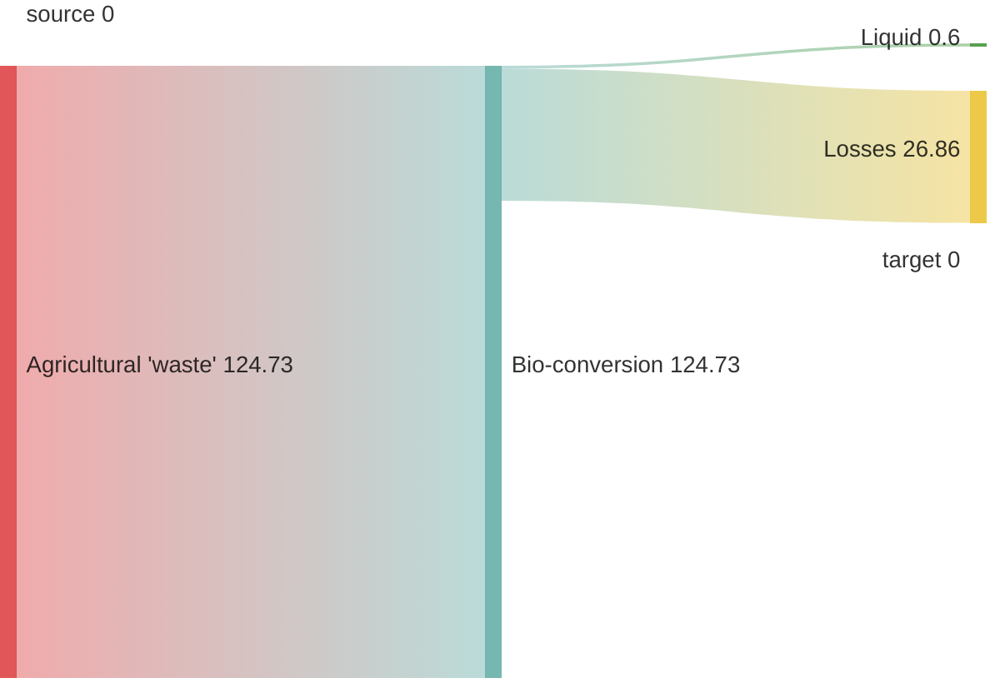
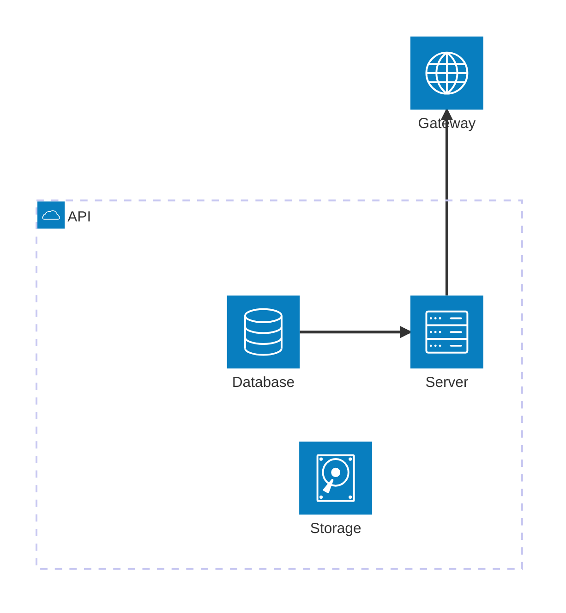

# Specialized Diagrams

Canonical syntax for the less-common Mermaid diagram types: mindmap, gantt, timeline, journey, gitGraph, pie, quadrantChart, requirementDiagram, plus the beta types (xychart, sankey, block, architecture).

## Table of Contents

- [Mindmap](#mindmap)
- [Gantt chart](#gantt-chart)
- [Timeline](#timeline)
- [User journey](#user-journey)
- [GitGraph](#gitgraph)
- [Pie chart](#pie-chart)
- [Quadrant chart](#quadrant-chart)
- [Requirement diagram](#requirement-diagram)
- [xychart-beta](#xychart-beta)
- [sankey-beta](#sankey-beta)
- [block-beta](#block-beta)
- [architecture-beta](#architecture-beta)

## Mindmap



**Node shapes (wrap the node's text):**

| Shape | Syntax |
|---|---|
| Default | `id` |
| Square | `id[Text]` |
| Rounded | `id(Text)` |
| Circle | `id((Text))` |
| Bang | `id))Text((` |
| Cloud | `id)Text(` |
| Hexagon | `id{{Text}}` |

**Extras:**
- Icons: `::icon(fa fa-book)` on its own indented line beneath the node (requires Font Awesome or Material font in the renderer).
- Classes: `:::className1 className2` after the node.
- Markdown strings: `**bold**`, `*italic*`. Newlines wrap.

**Rules and gotchas:**
- Hierarchy is defined by relative indentation. Don't mix tabs and spaces.
- Only one root — multiple top-level nodes error out.
- Unescaped `:` in node text breaks parsing (tokenized for `:::class` and `::icon`).
- Long single-line labels have crashed the renderer historically — keep under ~30 characters or break with markdown newlines.
- Marked experimental; syntax may evolve.

**Validation:**
- Total nodes ≤ 40.
- Depth ≤ 4 levels.
- No single-child branches (merge upward).
- Node text ≤ 6 words.
- Root is 1-3 words.

## Gantt chart



**Header directives:**

| Directive | Purpose |
|---|---|
| `title` | Chart title |
| `dateFormat` | Parse format (`YYYY-MM-DD`, `HH:mm`) |
| `axisFormat` | Display format (d3-time tokens: `%Y-%m-%d`, `%b %d`) |
| `tickInterval` | `1day`, `1week`, `2month` |
| `weekday` | `monday`..`sunday` — anchor for `1week` ticks |
| `excludes` | Skip: `weekends`, `sundays`, specific dates |
| `includes` | Un-exclude specific dates |
| `todayMarker` | `off` or a CSS string |
| `inclusiveEndDates` | End date is inclusive |
| `topAxis` | Axis at top |
| `displayMode compact` | Overlap tasks on same row |
| `section <name>` | Group following tasks |

**Task syntax:** `Label : [flags,] [id,] start, end-or-duration`.

**Flags:**

| Flag | Meaning |
|---|---|
| `done` | Completed (grey) |
| `active` | In progress (blue) |
| `crit` | Critical (red) |
| `milestone` | Zero-duration diamond |
| (none) | Future / default |

- Dates: ISO, `after <id1> <id2>`, or `until <id>`.
- Durations: `3d`, `1w`, `2h`.
- Interactive: `click <taskId> href "URL"` or `click <taskId> call callback()`.

**Gotchas:**
- Excluded days don't leave visual gaps — bars extend right to absorb them.
- Task IDs must be unique. `after` referencing an undefined ID silently starts at project start.
- `dateFormat` must match input exactly; mismatches hide tasks.
- `axisFormat` uses d3-time-format, not moment.
- No sub-day units unless `dateFormat` includes time.

## Timeline



**Elements:**

| Element | Syntax |
|---|---|
| Title | `title <text>` |
| Section | `section <name>` (colors following periods together) |
| Period + event | `<period-label> : <event>` |
| Multi-event | additional `: <event>` lines or chained `: a : b : c` |

**Config:** `disableMulticolor: true` forces a uniform color.

**Gotchas:**
- No date parsing — `2019` is just a string; order follows source order.
- Colons are significant; restructure to avoid colons inside event text.
- Section membership persists until the next `section`.
- Marked experimental; icon integration is the unstable part.

## User journey



**Elements:**

| Element | Syntax |
|---|---|
| Title | `title <text>` |
| Section | `section <name>` |
| Task | `<label>: <score>: <actor1>, <actor2>, ...` |

- Score is 1–5 (higher = happier); rendered as an emoji.
- Actors are comma-separated; each gets a colored dot.

**Gotchas:**
- Exactly three colon-separated fields per task line.
- Scores outside 1–5 clamp to an edge emoji.
- No node IDs or links — purely linear per section.
- Sections render left-to-right in source order.

## GitGraph

```mermaid
gitGraph
    commit id: "init"
    branch develop
    checkout develop
    commit
    commit tag: "v0.1"
    checkout main
    merge develop
    branch feature/x
    commit type: HIGHLIGHT
    checkout main
    cherry-pick id: "abc123"
```

**Commands:**

| Command | Form |
|---|---|
| `commit` | `commit [id: "..."] [tag: "..."] [type: NORMAL|REVERSE|HIGHLIGHT]` |
| `branch` | `branch <name> [order: <n>]` — creates and switches |
| `checkout` | `checkout <name>` (alias `switch`) |
| `merge` | `merge <branch> [id: "..."] [tag: "..."] [type: ...]` |
| `cherry-pick` | `cherry-pick id: "<commitId>" [parent: "<parentId>"] [tag: "..."]` |

**Commit types:** `NORMAL` (default), `REVERSE`, `HIGHLIGHT`.

**Config (via `%%{init: {'gitGraph': {...}}}%%` or frontmatter):**

| Option | Purpose |
|---|---|
| `showBranches` | Toggle branch labels |
| `showCommitLabel` | Toggle commit ids |
| `rotateCommitLabel` | Rotate ids 45° |
| `mainBranchName` | Rename default branch |
| `mainBranchOrder` | Vertical position of main |
| `parallelCommits` | Align horizontally by order |

**Orientation:** `gitGraph LR:` (default) or `gitGraph TB:`.

**Gotchas:**
- `cherry-pick` requires an explicit `id:` of an existing commit on a different branch.
- You can't `merge` a branch into itself, and can't `cherry-pick` a commit already on the current branch.
- `branch` auto-checks out; `checkout` doesn't create. Re-declaring an existing branch errors.
- Commit `id` must be globally unique — avoid mixing manual + auto ids carelessly.
- Only `NORMAL`, `REVERSE`, `HIGHLIGHT` are valid `type:` values.

## Pie chart



- `title <text>` (no quotes).
- `showData` prints numeric values in the legend.
- Slice: `"Label" : <positive number>` (up to 2 decimals).
- Config: `textPosition` (0.0 center → 1.0 edge; default 0.75).

**Gotchas:**
- Values must be `> 0`; zero and negatives error.
- Labels must be double-quoted.

## Quadrant chart

```mermaid
quadrantChart
    title Reach and engagement of campaigns
    x-axis Low Reach --> High Reach
    y-axis Low Engagement --> High Engagement
    quadrant-1 We should expand
    quadrant-2 Need to promote
    quadrant-3 Re-evaluate
    quadrant-4 May be improved
    Campaign A: [0.3, 0.6]
    Campaign B:::styleClass: [0.45, 0.23]
    Campaign C: [0.57, 0.69] radius: 8 color: #ff3300 stroke-color: #10f0f0 stroke-width: 3px
```

- Axis: `x-axis <left> --> <right>` (right side optional). Same for `y-axis`.
- Quadrants numbered: `1` = TR, `2` = TL, `3` = BL, `4` = BR.
- Points: coordinates **0–1 only** — out-of-range errors.
- Inline styling: `radius:`, `color:`, `stroke-color:`, `stroke-width:`. Or `:::className` with `classDef`.

**Gotchas:**
- With zero points, quadrant labels render at center; once any point exists, labels reflow to corners and the x-axis pins to bottom.
- Direct style > class style > theme.

## Requirement diagram



**Requirement types:** `requirement`, `functionalRequirement`, `interfaceRequirement`, `performanceRequirement`, `physicalRequirement`, `designConstraint`.

**Required fields:** `id`, `text`, `risk` (`Low` | `Medium` | `High`), `verifymethod` (`Analysis` | `Inspection` | `Test` | `Demonstration`).

**Element fields:** `type`, `docref` (both free-form strings).

**Relationships:** `contains`, `copies`, `derives`, `satisfies`, `verifies`, `refines`, `traces`.

**Arrow syntax:** `A - <type> -> B` or reversed `B <- <type> - A`.

**Gotchas:**
- Unquoted text breaks if it contains a keyword — use quotes. Quoted text supports markdown.
- Values for `risk` and `verifymethod` are case-insensitive but must be from the allowed set.

## xychart-beta



- Use `xychart-beta horizontal` to flip orientation.
- X-axis: categorical `[a, b, "c with space"]` **or** numeric `title min --> max`.
- Y-axis: `title min --> max`, or `title` alone for auto-range.
- Data: `bar [..]` and `line [..]`; both accept negative and decimal numbers.
- Multi-word titles must be quoted.

**Beta caveat:** axes are optional (auto-generated); theming keys may shift.

## sankey-beta



- Header line is literally `sankey-beta`; the body is CSV with **exactly 3 columns**.
- Quoting: only required when a field contains a comma. Wrap in `"..."`. Embedded `"` is escaped as `""`.
- Empty lines allowed for visual grouping.
- Config: `linkColor` (`source` | `target` | `gradient` | hex), `nodeAlignment` (`justify` | `center` | `left` | `right`), plus `width` / `height`.

**Beta caveat:** syntax is "close to plain CSV, to be extended" — don't rely on non-CSV features.

## block-beta

```mermaid
block-beta
  columns 3
  a["A label"] b(("Circle")) c{"Rhombus"}
  space:2 d
  D[
    a1 b1
    c1
  ]
  classDef blue fill:#0a0,stroke:#0f0,color:#000;
  class a blue
  style b fill:#f9f,stroke:#333,stroke-width:2px
```

**Shapes (same token set as flowcharts):**

| Shape | Syntax |
|---|---|
| Default | `a["label"]` |
| Rounded | `a("label")` |
| Stadium | `a(["label"])` |
| Subroutine | `a[["label"]]` |
| Cylindrical | `a[("label")]` |
| Circle | `a((label))` |
| Asymmetric | `a>"label"]` |
| Rhombus | `a{"label"}` |
| Hexagon | `a{{"label"}}` |
| Parallelogram | `a[/"label"/]` |
| Trapezoid | `a[\"label"\]` |
| Double circle | `a(((label)))` |

- `columns N` sets grid width; blocks wrap.
- `space` is an empty cell; `space:N` spans N columns.
- Nested: `D[ a b \n c ]` preserves layout via the line break inside brackets.
- Edges use flowchart arrows: `A --> B`, labeled as `A -- "text" --> B` or `A --> |"text"| B`.
- Styling via `classDef` / `class` / `style`, same as flowchart.

**Beta caveat:** layout is manual (columns + order); no auto-routing like flowchart.

## architecture-beta



- **Service:** `service <id>(<icon>)[<label>] [in <parentGroupId>]`
- **Group:** `group <id>(<icon>)[<title>] [in <parentGroupId>]`
- **Junction:** `junction <id> [in <parentGroupId>]` — 4-way routing node.
- **Edge:** `<id>:{T|B|L|R} <connector> {T|B|L|R}:<id>`
  - Connectors: `--` (line), `-->` / `<--` (arrow), `<-->` (bi).
  - Group-crossing: append `{group}` after the service id to route through a group boundary (e.g. `db:R{group} --> L:gateway`).

**Default icon pack:** `cloud`, `database`, `disk`, `internet`, `server`.

**Extended icons:** register iconify packs, then use `"pack:icon-name"` (quotes required because of the colon).

**Gotchas:**
- You cannot use a group id directly as an edge endpoint — only services. The `{group}` modifier is the way to draw group-boundary edges.
- `randomize` config (v11.14.0+) defaults to `false` for reproducible layouts.
- Labels, direction tokens, and icon pack loading have changed between 11.x minors — pin the Mermaid version if you rely on specific behavior.
